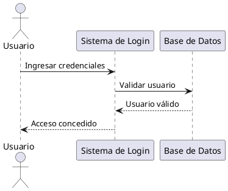

# 🎨 ColoUML Editor - Editor PlantUML Online Gratis

[](https://colo-uml-editor.vercel.app)
[](https://nextjs.org/)
[](LICENSE)

**Editor PlantUML online gratis en español** con autocompletado inteligente y autoguardado automático. La mejor herramienta para crear diagramas UML profesionales.

🚀 **[Pruébalo ahora](https://colo-uml-editor.vercel.app)**

## ✨ Características Principales

- 🤖 **Autocompletado Inteligente**: Sugiere automáticamente clases, participantes, actores e interfaces mientras escribes
- 💾 **Autoguardado**: Tu trabajo se guarda automáticamente en el navegador
- ⚡ **Vista Previa Instantánea**: Genera y visualiza tus diagramas UML en tiempo real
- 🎯 **Snippets Predefinidos**: Inserta rápidamente loops, alt/else y plantillas de clases
- 🌐 **100% Online**: No requiere instalación ni registro
- 🇪🇸 **En Español**: Interfaz completamente en español
- 🎨 **Interfaz Moderna**: Diseño limpio y profesional

## 📊 Tipos de Diagramas Soportados

- Diagramas de Clases
- Diagramas de Secuencia
- Casos de Uso
- Diagramas de Actividad
- Diagramas de Componentes
- Diagramas de Estado
- Y todos los tipos de PlantUML

## 🚀 Inicio Rápido

Simplemente visita [https://colo-uml-editor.vercel.app](https://colo-uml-editor.vercel.app) y comienza a crear tus diagramas UML.

### Ejemplo de Código PlantUML



## 🎯 ¿Para Quién es Este Editor?

- 👨‍💻 **Desarrolladores**: Documenta tu código con diagramas de clases y secuencia
- 🎓 **Estudiantes**: Crea diagramas para tus proyectos y tareas de ingeniería de software
- 🏢 **Arquitectos de Software**: Diseña y comunica arquitecturas complejas
- 📝 **Analistas**: Modela casos de uso y procesos de negocio

## 💡 Ventajas sobre Otros Editores PlantUML

| Característica | ColoUML Editor | Otros Editores |
|----------------|----------------|----------------|
| Autocompletado Inteligente | ✅ | ❌ |
| Autoguardado | ✅ | ⚠️ Limitado |
| En Español | ✅ | ❌ |
| Gratis Sin Límites | ✅ | ⚠️ Con restricciones |
| Sin Registro | ✅ | ⚠️ Requieren cuenta |

## 🛠️ Tecnologías

- **Next.js 15**: Framework React de última generación
- **TypeScript**: Código tipado y seguro
- **Tailwind CSS**: Estilos modernos y responsivos
- **PlantUML**: Motor de renderizado de diagramas
- **Vercel**: Hosting y deployment

## 📦 Instalación Local

```bash
# Clonar el repositorio
git clone https://github.com/ignaw05/ColoUML-Editor.git

# Instalar dependencias
cd ColoUML-Editor
pnpm install

# Ejecutar en modo desarrollo
pnpm dev

# Abrir http://localhost:3000
```

## 🤝 Contribuir

Las contribuciones son bienvenidas. Por favor:

1. Fork el proyecto
2. Crea una rama para tu feature (`git checkout -b feature/AmazingFeature`)
3. Commit tus cambios (`git commit -m 'Add some AmazingFeature'`)
4. Push a la rama (`git push origin feature/AmazingFeature`)
5. Abre un Pull Request

## 📝 Licencia

Este proyecto está bajo la Licencia MIT. Ver el archivo `LICENSE` para más detalles.

## 🔗 Links

- **Website**: [https://colo-uml-editor.vercel.app](https://colo-uml-editor.vercel.app)
- **GitHub**: [https://github.com/ignaw05/ColoUML-Editor](https://github.com/ignaw05/ColoUML-Editor)

## 📧 Contacto

¿Preguntas o sugerencias? Abre un issue en GitHub.

---

**Keywords**: editor plantuml online, editor uml gratis, diagrama online, diagrama de clases online, diagrama de secuencia online, casos de uso online, crear diagramas uml, plantuml español, herramienta uml, modelado uml

⭐ Si te gusta este proyecto, ¡dale una estrella en GitHub!
